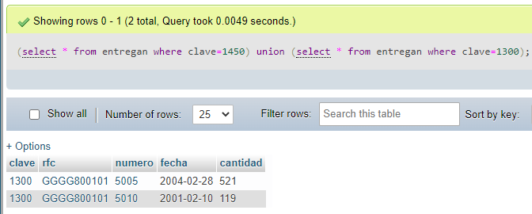

# Laboratorio 20: Consultas SQL

## Selección

```sql
SELECT * FROM materiales
```
;


```sql
SELECT * FROM materiales
WHERE clave = 1000
```
;


## Proyección

Algebra relacional.
PR{clave,rfc,fecha} (entregan)

```SQL
SELECT clave,rfc,fecha FROM entregan
```


## Reunión Natural

Algebra relacional.
entregan JN materiales

```SQL
SELECT * FROM materiales,entregan
WHERE materiales.clave = entregan.clave
```


> Si algún material no ha se ha entregado ¿Aparecería en el resultado de esta consulta?

Sólo aparecerán aquellas tuplas que se encuentren en *entregados* que correspondan con la clave de materiales. La tabla de *entregados* sólo posee aquellos materiales que han sido entregados.

## Reunión con criterio específico

Algebra relacional.
entregan JN{entregan.numero <= proyectos.numero} proyectos

```SQL
SELECT * FROM entregan,proyectos
WHERE entregan.numero <= proyectos.numero
```


## Unión (se ilustra junto con selección)

*Nota importante: La tupla 1450 **no existe***

Algebra relacional.
SL{clave=1450}(entregan) UN SL{clave=1300}(entregan)

```SQL
(SELECT * FROM entregan WHERE clave=1450)
union
(SELECT * FROM entregan WHERE clave=1300)
```


>¿Cuál sería una consulta que obtuviera el mismo resultado sin usar el operador Unión? Compruébalo.

```SQL
SELECT *
FROM entregan
WHERE clave=1450 OR clave=1300
```


## Intersección (se ilustra junto con selección y proyección)

Algebra relacional.
PR{clave}(SL{numero=5001}(entregan)) IN PR{clave}(SL{numero=5018}(entregan))

>Nota: Debido a que en SQL server no tiene definida alguna palabra reservada que nos permita hacer esto de una manera entendible, veremos esta sección en el siguiente laboratorio con el uso de Subconsultas. Un ejemplo de un DBMS que si tiene la implementación de una palabra reservada para esta función es Oracle, en él si se podría generar la consulta con una sintaxis como la siguiente:

```SQL
(SELECT clave FROM entregan WHERE numero=5001)
intersect
(SELECT clave FROM entregan WHERE numero=5018)
```
Para phpmyAdmin se usa inner joins, pero para este caso podemos hacer:

>Sin inner join
```SQL
SELECT clave 
FROM entregan WHERE numero=5001 OR numero=5018
```


## Diferencia (se ilustra con selección )

Algebra relacional.
entregan - SL{clave=1000}(entregan)

```SQL
(SELECT * FROM entregan)
minus
(SELECT * FROM entregan WHERE clave=1000)
```
>Nuevamente, "minus" es una palabra reservada que no está definida en SQL Server, define una consulta que regrese el mismo resultado.

Una consulta alterna puede ser

```SQL
SELECT * FROM entregan
WHERE clave!=1000
```

Esto no es una diferencia real pues sólo lo extrae del mismo conjunto de datos pro el resultado es el mismo.


# Producto cartesiano

Algebra relacional.
entregan X materiales

```SQL
SELECT * FROM entregan,materiales
```

>¿Cómo está definido el número de tuplas de este resultado en términos del número de tuplas de entregan y de materiales?

Las tuplas están definidas como un producto matricial.
El número resultante es la cardinalidad de una tabla multiplicado por la cardinalidad de la otra. 
*entregan* x *materiales*


Construcción de consultas a partir de una especificación

Plantea ahora una consulta para obtener las descripciones de los materiales entregados en el año 2000.

Recuerda que la fecha puede indicarse como '01-JAN-2000' o '01/01/00'.

Importante: Recuerda que cuando vayas a trabajar con fechas, antes de que realices tus consultas debes ejecutar la instrucción "set dateformat dmy". Basta con que la ejecutes una sola vez para que el manejador sepa que vas a trabajar con ese formato de fechas.

¿Por qué aparecen varias veces algunas descripciones de material?

Uso del calificador distinct

En el resultado anterior, observamos que una misma descripción de material aparece varias veces.

Agrega la palabra distinct inmediatamente después de la palabra SELECT a la consulta que planteaste antes.

¿Qué resultado obtienes en esta ocasión?

Ordenamientos.

Si al final de una sentencia SELECT se agrega la cláusula

order by campo [desc] [,campo [desc] ...]

donde las partes encerradas entre corchetes son opcionales (los corchetes no forman parte de la sintaxis), los puntos suspensivos indican que pueden incluirse varios campos y la palabra desc se refiere a descendente. Esta cláusula permite presentar los resultados en un orden específico.

Obtén los números y denominaciones de los proyectos con las fechas y cantidades de sus entregas, ordenadas por número de proyecto, presentando las fechas de la más reciente a la más antigua.

Uso de expresiones.

En álgebra relacional los argumentos de una proyección deben ser columnas. Sin embargo en una sentencia SELECT es posible incluir expresiones aritméticas o funciones que usen como argumentos de las columnas de las tablas involucradas o bien constantes. Los operadores son:

+ Suma
- Resta
* Producto
/ División

Las columnas con expresiones pueden renombrarse escribiendo después de la expresión un alias que puede ser un nombre arbitrario; si el alias contiene caracteres que no sean números o letras (espacios, puntos etc.) debe encerrarse entre comillas dobles (" nuevo nombre" ). Para SQL Server también pueden utilizarse comillas simples.

Operadores de cadena

El operador LIKE se aplica a datos de tipo cadena y se usa para buscar registros, es capaz de hallar coincidencias dentro de una cadena bajo un patrón dado.

También contamos con el operador comodín (%), que coincide con cualquier cadena que tenga cero o más caracteres. Este puede usarse tanto de prefijo como sufijo.

SELECT * FROM productos WHERE Descripcion LIKE 'Si%'

¿Qué resultado obtienes?
Explica que hace el símbolo '%'.
¿Qué sucede si la consulta fuera : LIKE 'Si' ?
¿Qué resultado obtienes?
Explica a qué se debe este comportamiento.

Otro operador de cadenas es el de concatenación, (+, +=) este operador concatena dos o más cadenas de caracteres.
Su sintaxis es : Expresión + Expresión.
Un ejemplo de su uso, puede ser: Un ejemplo de su uso, puede ser:
SELECT (Apellido + ', ' + Nombre) as Nombre FROM Personas;

DECLARE @foo varchar(40);
DECLARE @bar varchar(40);
SET @foo = '¿Que resultado';
SET @bar = ' ¿¿¿??? '
SET @foo += ' obtienes?';
PRINT @foo + @bar;

¿Qué resultado obtienes de ejecutar el siguiente código?
¿Para qué sirve DECLARE?
¿Cuál es la función de @foo?
¿Que realiza el operador SET?

Sin embargo, tenemos otros operadores como [ ] , [^] y _.

[ ] - Busca coincidencia dentro de un intervalo o conjunto dado. Estos caracteres se pueden utilizar para buscar coincidencias de patrones como sucede con LIKE.

[^] - En contra parte, este operador coincide con cualquier caracter que no se encuentre dentro del intervalo o del conjunto especificado.

_ - El operador _ o guion bajo, se utiliza para coincidir con un caracter de una comparación de cadenas.

Ahora explica el comportamiento, función y resultado de cada una de las siguientes consultas:

SELECT RFC FROM Entregan WHERE RFC LIKE '[A-D]%';
SELECT RFC FROM Entregan WHERE RFC LIKE '[^A]%';
SELECT Numero FROM Entregan WHERE Numero LIKE '___6';

Operadores compuestos.

Los operadores compuestos ejecutan una operación y establecen un valor.
+ = (Suma igual)
- = (Restar igual)
* = (Multiplicar igual)
/ = (Dividir igual)
% = (Módulo igual)

Operadores Lógicos.

Los operadores lógicos comprueban la verdad de una condición, al igual que los operadores de comparación, devuelven un tipo de dato booleano (True, false o unknown).

ALL Es un operador que compara un valor numérico con un conjunto de valores representados por un subquery. La condición es verdadera cuando todo el conjunto cumple la condición.

ANY o SOME Es un operador que compara un valor numérico con un conjunto de valores. La condición es verdadera cuando al menos un dato del conjunto cumple la condición.

La sintaxis para ambos es: valor_numerico {operador de comparación} subquery

BETWEEN Es un operador para especificar intervalos. Una aplicación muy común de dicho operador son intervalos de fechas.

SELECT Clave,RFC,Numero,Fecha,Cantidad
FROM Entregan
WHERE Numero Between 5000 and 5010;

¿Cómo filtrarías rangos de fechas?

EXISTS Se utiliza para especificar dentro de una subconsulta la existencia de ciertas filas.

SELECT RFC,Cantidad, Fecha,Numero
FROM [Entregan]
WHERE [Numero] Between 5000 and 5010 AND
Exists ( SELECT [RFC]
FROM [Proveedores]
WHERE RazonSocial LIKE 'La%' and [Entregan].[RFC] = [Proveedores].[RFC] )

¿Qué hace la consulta?
¿Qué función tiene el paréntesis ( ) después de EXISTS?

IN Especifica si un valor dado tiene coincidencias con algún valor de una subconsulta. NOTA: Se utiliza dentro del WHERE pero debe contener un parametro. Ejemplo: WHERE proyecto.id IN Lista_de_Proyectos_Subquery

Tomando de base la consulta anterior del EXISTS, realiza el query que devuelva el mismo resultado, pero usando el operador IN

NOT Simplemente niega la entrada de un valor booleano.

Tomando de base la consulta anterior del EXISTS, realiza el query que devuelva el mismo resultado, pero usando el operador NOT IN Realiza un ejemplo donde apliques algún operador : ALL, SOME o ANY.

El Operador TOP, es un operador que recorre la entrada, un query, y sólo devuelve el primer número o porcentaje especifico de filas basado en un criterio de ordenación si es posible.

¿Qué hace la siguiente sentencia? Explica por qué.

SELECT TOP 2 * FROM Proyectos

¿Qué sucede con la siguiente consulta? Explica por qué.

SELECT TOP Numero FROM Proyectos

Modificando la estructura de un tabla existente.

Agrega a la tabla materiales la columna PorcentajeImpuesto con la instrucción:
ALTER TABLE materiales ADD PorcentajeImpuesto NUMERIC(6,2);
A fin de que los materiales tengan un impuesto, les asignaremos impuestos ficticios basados en sus claves con la instrucción:
UPDATE materiales SET PorcentajeImpuesto = 2*clave/1000;
esto es, a cada material se le asignará un impuesto igual al doble de su clave dividida entre diez.

Revisa la tabla de materiales para que compruebes lo que hicimos anteriormente.

¿Qué consulta usarías para obtener el importe de las entregas es decir, el total en dinero de lo entregado, basado en la cantidad de la entrega y el precio del material y el impuesto asignado?

Creación de vistas

La sentencia:

Create view nombrevista (nombrecolumna1 , nombrecolumna2 ,..., nombrecolumna3 )
as SELECT...

Permite definir una vista. Una vista puede pensarse como una consulta etiquetada con un nombre, ya que en realidad al referirnos a una vista el DBMS realmente ejecuta la consulta asociada a ella, pero por la cerradura del álgebra relacional, una consulta puede ser vista como una nueva relación o tabla, por lo que es perfectamente válido emitir la sentencia:

SELECT * FROM nombrevista

¡Como si nombrevista fuera una tabla!

Comprueba lo anterior, creando vistas para cinco de las consultas que planteaste anteriormente en la práctica . Posteriormente revisa cada vista creada para comprobar que devuelve el mismo resultado.

La parte (nombrecolumna1,nombrecolumna2,.de la sentencia create view puede ser omitida si no hay ambigüedad en los nombres de las columnas de la sentencia SELECT asociada.

Importante: Las vistas no pueden incluir la cláusula order by.

A continuación se te dan muchos enunciados de los cuales deberás generar su correspondiente consulta.

En el reporte incluye la sentencia, una muestra de la salida (dos o tres renglones) y el número de renglones que SQL Server reporta al final de la consulta.

      Los materiales (clave y descripción) entregados al proyecto "México sin ti no estamos completos".

      Los materiales (clave y descripción) que han sido proporcionados por el proveedor "Acme tools".

      El RFC de los proveedores que durante el 2000 entregaron en promedio cuando menos 300 materiales.

      El Total entregado por cada material en el año 2000.

      La Clave del material más vendido durante el 2001. (se recomienda usar una vista intermedia para su solución)

      Productos que contienen el patrón 'ub' en su nombre.

      Denominación y suma del total a pagar para todos los proyectos.

      Denominación, RFC y RazonSocial de los proveedores que se suministran materiales al proyecto Televisa en acción que no se encuentran apoyando al proyecto Educando en Coahuila (Solo usando vistas).

      Denominación, RFC y RazonSocial de los proveedores que se suministran materiales al proyecto Televisa en acción que no se encuentran apoyando al proyecto Educando en Coahuila (Sin usar vistas, utiliza not in, in o exists).

      Costo de los materiales y los Materiales que son entregados al proyecto Televisa en acción cuyos proveedores también suministran materiales al proyecto Educando en Coahuila.

      Reto: Usa solo el operador NOT IN en la consulta anterior (No es parte de la entrega).

      Nombre del material, cantidad de veces entregados y total del costo de dichas entregas por material de todos los proyectos.

      Muchas de estas consultas requieren la utilización de funciones agregadas...

      Se recomienda que revises nuevamente la lectura. 