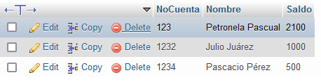
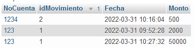
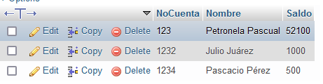
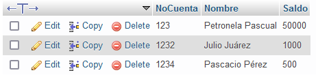
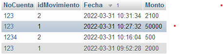

# Transacciones 
Las transaccions consisten de 4 propiedades **ACID**

* A. Atomicidad
* C. Coherencia
* I. Aislamiento (isolation)
* D. Durabilidad

>Garantiza con las transacciones todas las propiedades de ACID

# Pruebas
Depositemos 50000 pesos a la cuenta 123 (Petronel Pascual)



Ejecutamos:

```SQL
CALL registrarMovimientoBancario (123,1,50000)
```




Retiremos 2100 pesos a la cuenta 123 (Petronela Pascual)


Ejecutamos:

```SQL
CALL registrarMovimientoBancario (123,2,2100)
```



